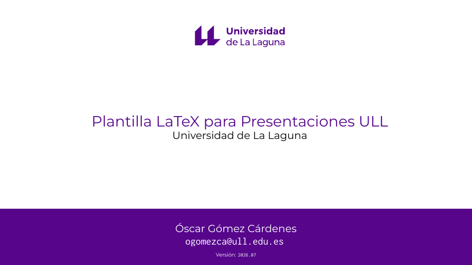
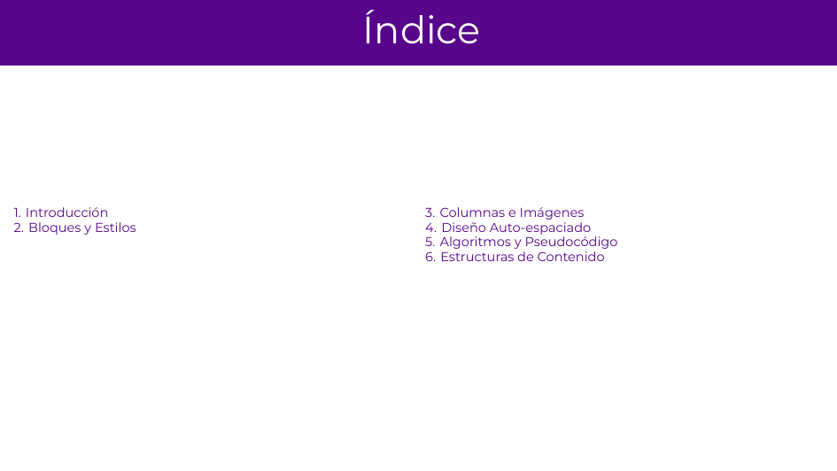
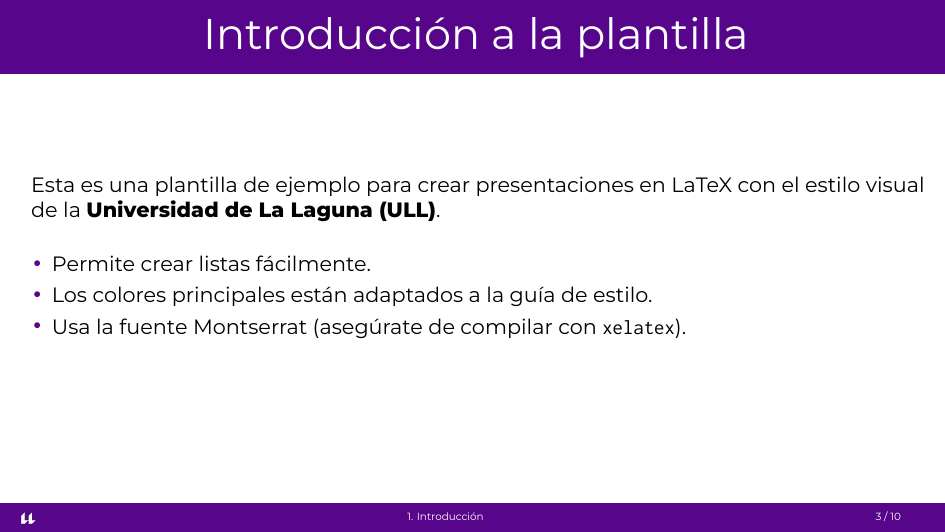
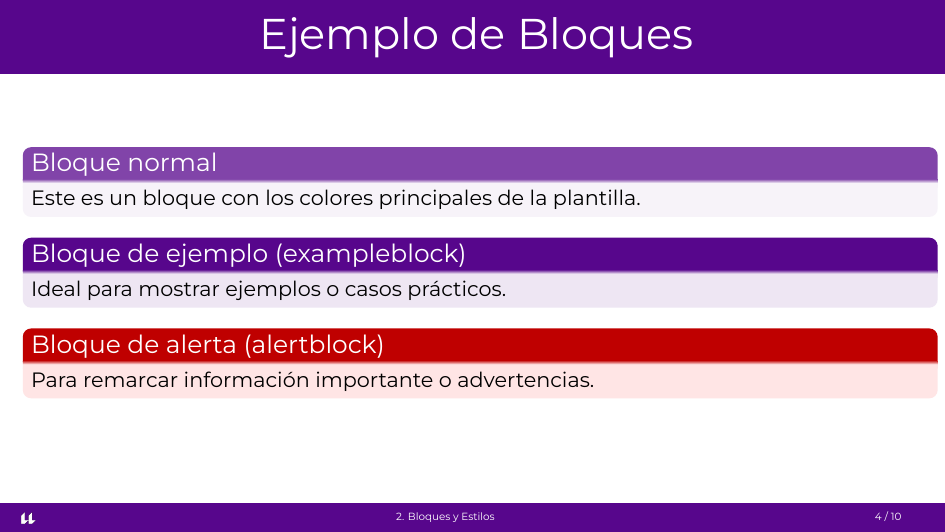
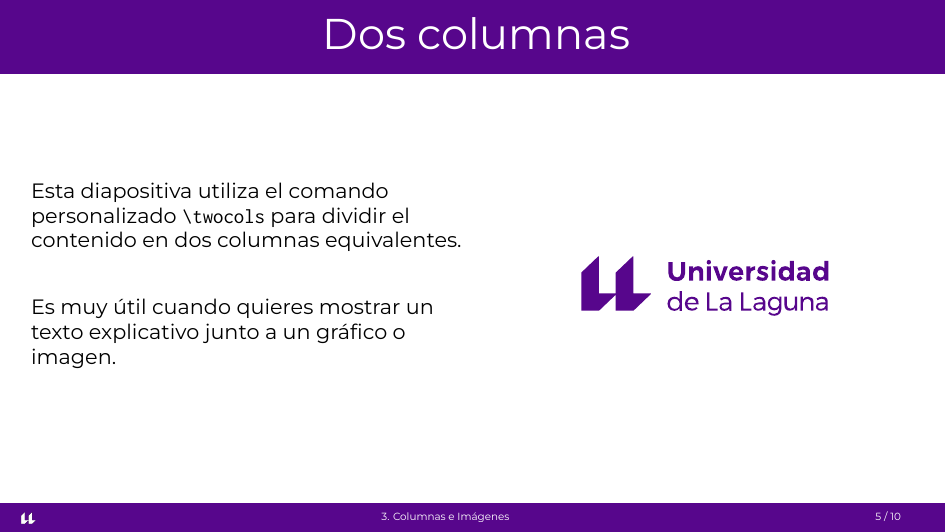
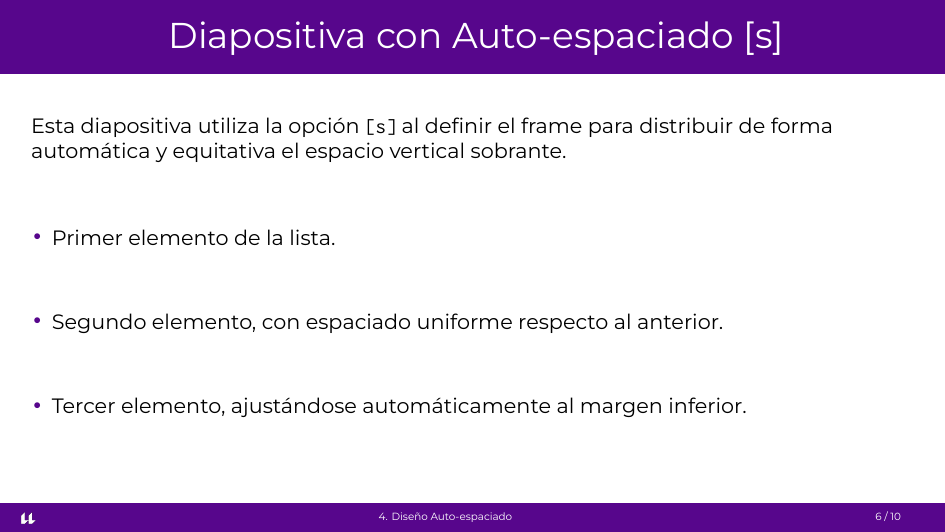
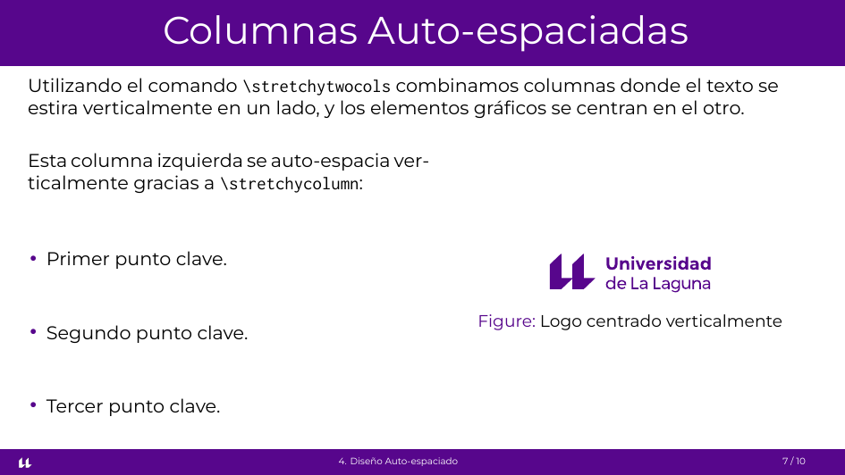
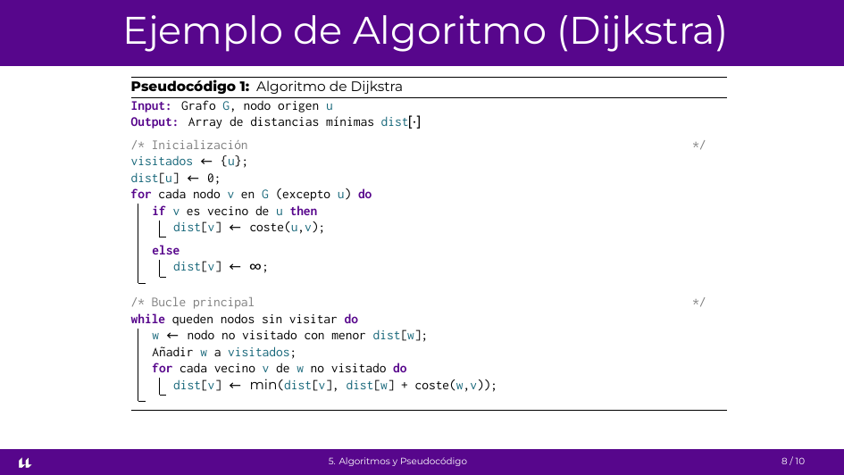
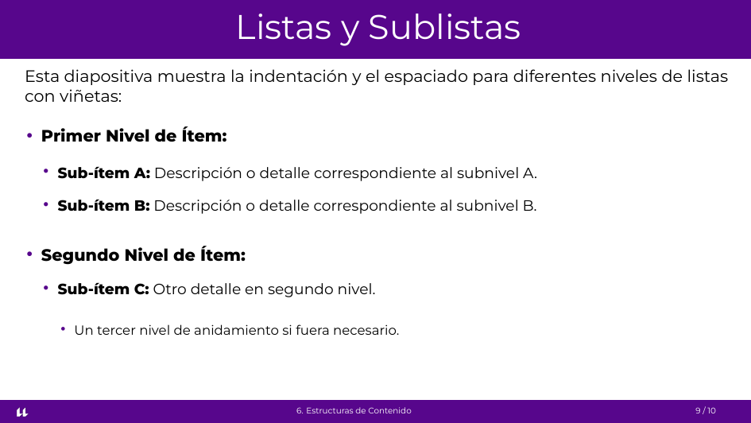
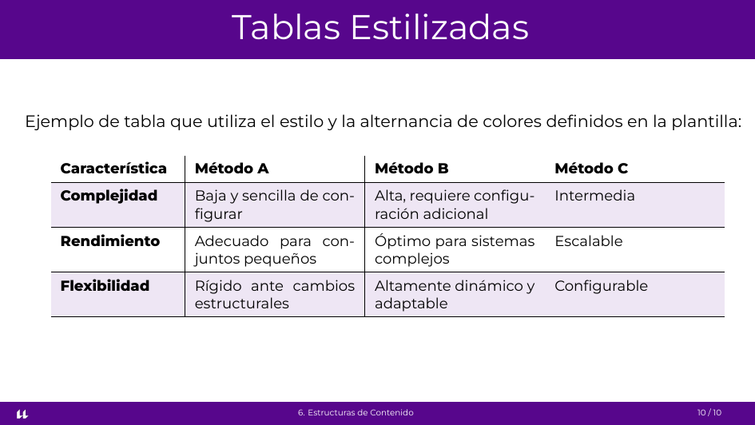

# Plantilla Beamer - Universidad de La Laguna (ULL)

Esta es una plantilla de LaTeX (Beamer) no oficial diseñada para crear presentaciones académicas y docentes con la identidad visual corporativa de la **Universidad de La Laguna (ULL)**.

## Vista Previa

<table>
  <tr>
    <td align="center"><b>Portada</b><br/></td>
    <td align="center"><b>Índice</b><br/></td>
    <td align="center"><b>Introducción</b><br/></td>
  </tr>
  <tr>
    <td align="center"><b>Bloques</b><br/></td>
    <td align="center"><b>Dos Columnas</b><br/></td>
    <td align="center"><b>Auto-espaciado</b><br/></td>
  </tr>
  <tr>
    <td align="center"><b>Cols Auto-espaciadas</b><br/></td>
    <td align="center"><b>Pseudocódigo</b><br/></td>
    <td align="center"><b>Listas y Sublistas</b><br/></td>
  </tr>
  <tr>
    <td align="center"><b>Tablas</b><br/></td>
    <td colspan="2"></td>
  </tr>
</table>

## Características

- Colores corporativos (púrpura ULL).
- Tipografías modernas (Montserrat, Inconsolata).
- Layout limpio y minimalista.
- **Personalización simplificada:** Configuración de autoría y versión extraída a un fichero externo.
- **Diseño vertical auto-espaciado:** Soporte para frames que distribuyen el espacio vertical de forma equitativa mediante la opción `[s]`.
- Comandos personalizados para facilitar layouts de dos columnas (`\twocols` y `\stretchytwocols`).
- Soporte para bloques (`block`, `exampleblock`, `alertblock`).

## Configuración y Personalización

Para cambiar el nombre del autor, el correo de contacto o la versión de las diapositivas, no necesitas editar el archivo de estilo `.sty`. Simplemente modifica el archivo **`config.tex`** en la raíz del proyecto:

```latex
% Nombre del autor / docente
\newcommand{\authorname}{Tu Nombre Aquí}

% Correo electrónico de contacto
\newcommand{\authoremail}{tu-email@ull.edu.es}

% Versión del documento / plantilla
\newcommand{\templateversion}{1.0.0}
```

## Requisitos de compilación

**IMPORTANTE:** Esta plantilla utiliza fuentes TrueType/OpenType del sistema, por lo que **DEBE** compilarse usando **XeLaTeX** o LuaLaTeX (no funcionará correctamente con pdflatex estándar).

Ejemplo de compilación local desde la terminal:

```bash
xelatex main.tex
```

## Uso en Overleaf

Puedes abrir directamente la plantilla en Overleaf usando el siguiente enlace:
👉 **[Plantilla en Overleaf](https://www.overleaf.com/read/trszznfdckdj#551349)** (una vez abierta, puedes [copiarla a tu cuenta](https://docs.overleaf.com/managing-projects-and-files/copying-a-project) para poder editarla).

## Estructura de archivos

- `main.tex`: Archivo principal con diapositivas de ejemplo.
- `config.tex`: Archivo de configuración rápida para tus datos de autor y versión.
- `common/beamerthemeull.sty`: El archivo de estilo con toda la configuración del tema visual.
- `common/`: Carpeta que contiene los logos institucionales y recursos del tema (`ull_logo.pdf`, `icono-ull-blanco.png`, etc.).

## Licencia

Este proyecto se distribuye bajo la licencia **MIT** (ver el archivo `LICENSE`). Eres libre de utilizar la plantilla, modificarla y distribuirla, incluso para uso comercial, siempre que mantengas la nota de derechos de autor.

*Creada originalmente por Óscar Gómez Cárdenes.*
